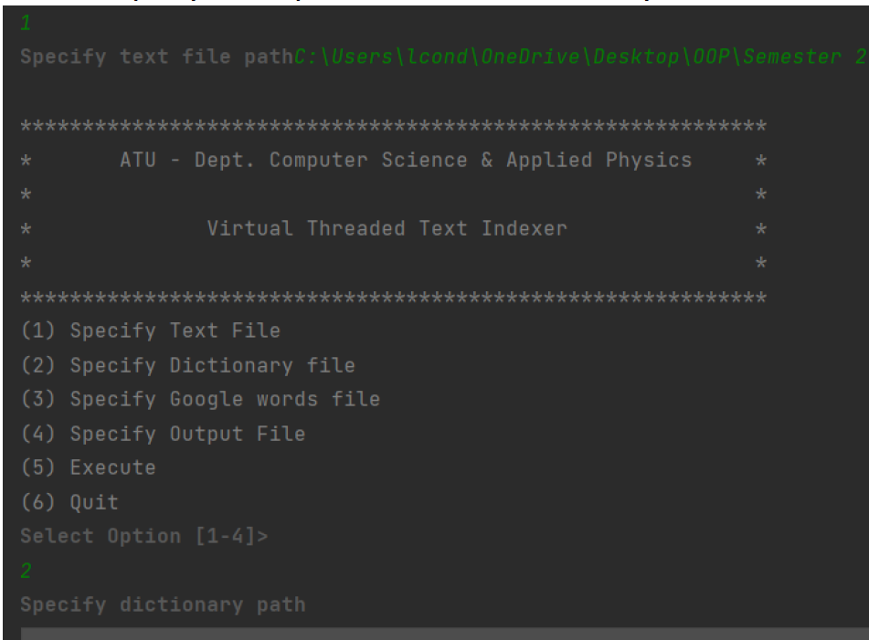

# Multithreaded-Index-API

### **About the Project**
Aim of the Java program is to read in text files from a text(E-Book) and also read in a dictionary and the Google-100 common words.

The programme will return a list of words with their meanings along with the number of the page that they are found on from the E-Book and also any words that are found in the google-1000 words text will not compute

### Tools used ###
- Intellij IDE
- Java

#### Instructions to run the Programme:
1.	Press 1 to specify the file path as to where the text file should be read in from (Please specify with the name of the text file when including the file path)

2.	Press 2 to specify the file path as to where the dictionary file should be read in from

3.	Press 3 to specify the file path as to where the google file should be read in from

4.	Press 4 to specify the file path as to where the output file should be saved to

5. Press 5 will execute the programme and provide an output in the console as per below
   This builds the application and is very quick to execute due to the virtual threads method being implemented
   
6. Press 6 will quit the programme and the Runner will stop

 ## Features

   • All menu options are in the Menu Template class which the Menu class takes in the constructor from this class and gives a switch statement letting the user to press the relevant keys for the relevant actions

   
   • Settings items are in the settings class – this is set up so that the user can specify their own settings from their own computer as to how the required files are read into the Java application